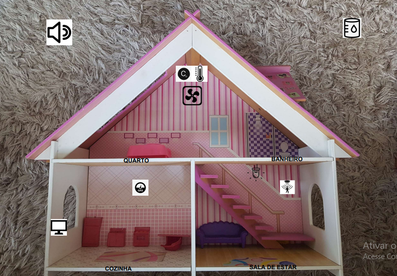
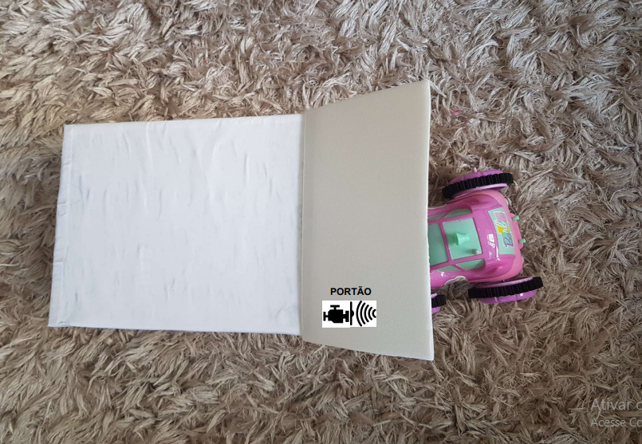
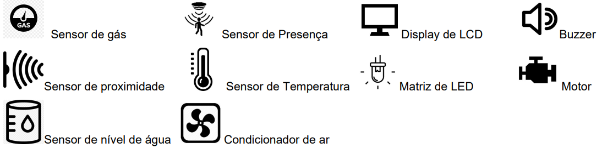

# Design

Utilizaremos os seguintes componentes eletrônicos para confecção do projeto previamente definido:

-Placa MEGA 2560 R3 + Fonte + Cabo USB para Arduino

-Sensor de Umidade e Temperatura DHT11

-Sensor de presença e movimento PIR

-Sensor de gás MQ-2 inflamável e fumaça

-Micro Servo SG92R 9g TowerPro

-Módulo Sensor de Umidade/Nível Água Chuva

-Módulo Relé 5 V e um Canal

-Sensor ultrasônico HC-SR04

-Módulo Matriz de LED 8×8 com MAX7219

-Buzzer passivo

-Display LCD 16×2 I2C Backlight Azul

Através da maquete eletrônica planejamos as conexões entre os materiais na etapa da implementação. A seguir, será apresentada uma breve explicação de cada componente que compõe o projeto e o motivo pelo qual eles foram selecionados:

* Arduino Mega 2560: É o responsável por controlar todo o sistema e por essa razão todos os demais componentes são conectados aos seus pinos de entrada e saída. O Arduino Mega 2560 foi selecionado por possuir um maior número de portas e mais memória, se comparado ao Arduino Uno.

* Servo TowerPro MG995: É controlado por meio de um pino de saída digital PWM e será responsável por controlar o portão da casa. Esse modelo é ideal para utilização com arduino, pois é alimentado com 5V, que é a mesma tensão que o arduino fornece, além de seu tamanho reduzido que é uma vantagem para essa aplicação.

* HC-sr501: Esse é o modelo do sensor de presença que será utilizado, ele é alimentado com 5V e é conectado a um pino de entrada digital. Quando detectado algum movimento ele enviará nível lógico alto para o arduíno.

* MQ2: Sensor de gás selecionado pois ele detecta GLP(gás de cozinha) e fumaça. Ele pode ser conectado a um pino de entrada digital que receberá nível lógico alto quando for detectado gás e um pino de entrada analógica que receberá a concentração de gás verificada pelo sensor.

* DHT11: Sensor de temperatura e umidade alimentado com 5V, ele envia os dados registrados por um pino de entrada analógica.

* LDR: É um sensor de luminosidade e sua resistência varia de acordo com a intensidade de luz, desse modo é necessário um resistor para que o pino de entrada analógica do arduino possa identificar a variação de resistência no LDR por meio da tensão sobre ele. 

* Módulo Buzzer Passivo 5V : Controlado por um pino de saída digital PWM, emitirá diferentes sons para alertar o usuário do sistema.

* Módulo relé 5V: O relé será acionado por meio de um pino de saída digital e será utilizado para controlar o cooler. O uso dele faz-se necessário, pois a corrente dos pinos de saída não seriam suficientes para liga-lo, além de ser mais seguro devido ao relé isolar o cooler do microcontrolador.

* Cooler 5V: Liga e desliga por meio do relé, alimentado com 5V.

 * Display LCD 16x2 I2C: O display LCD necsessita de diversos pinos para se conectar ao Arduino, porém com módulo I2C integrado essa conexão é feita utilizando apenas quatro pinos. Dois pinos são utilizados para alimentação e os outros dois para comunicação, no caso do Arduino Mega os pinos I2C a serem utilizados são o 20 (SDA) e 21 (SCL). O display LCD será resposável por exibir mensagens sobre o funcionamento do sistema.  

* LEDs: Os LEDs serão controlados por pinos de saídas digitais e necessitam de resistores para que tenham tensão de 3V e corrente menor que 5mA.

Abaixo podemos observar um protótipo do projeto físico:

